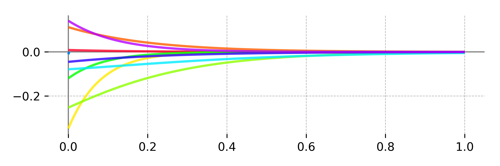

.. _introduction:

Introduction
============

In many real world time series, events trigger "ripples" in a dependent variable that unfold slowly and overlap in time (temporal diffusion).
Recovering the underlying dynamics of temporally diffuse effects is challenging when events and/or responses occur at irregular intervals.
Continuous-time deconvolutional regression (CDR) is a regression technique for time series that directly models temporal diffusion of effects (Shain & Schuler, 2018, 2021).
CDR uses machine learning to estimate continuous-time impulse response functions (IRFs) that mediate between predictors (event properties) and responses.
Given data and a model template specifying the functional form(s) of the IRF kernel(s), CDR finds IRF parameters that optimize some objective function.
This approach can be generalized to account for non-stationary, non-linear, non-additive, and context-dependent response functions by implementing the IRF as a deep neural network (Shain, 2021).

The ``cdr`` package documented here provides a Python implementation of a general-purpose CDR framework that allows users to flexibly select among neural network and kernel-based approaches to continuous-time deconvolution, and even to combine both approaches within a single model.
This package provides (1) an API for programming with CDR(NN) and (2) executables that allow users to train and evaluate CDR(NN) models out of the box, without needing to write any code.
Source code and bug reporting tools are available on `Github <https://github.com/coryshain/cdr>`_.

Installation (PyPI)
-------------------
Install `python <https://www.python.org/>`_, then install CDR(NN) using ``pip`` as follows::

    pip install cdrnn

Note that, despite the package name, both (kernel-based) CDR and (deep-neural) CDRNN are both implemented by the same codebase, so both kinds of models can be fitted using this package.

Installation (Anaconda)
-----------------------

Install `anaconda <https://www.anaconda.com/>`_ and clone the CDR repository (`<https://github.com/coryshain/cdr>`_) to the directory of your choice.
From the CDR repository root, run the following commands to create a new conda environment::

    conda env create -f conda_cdr.yml
    conda activate cdr

(Optional) Run the following from the CDR repository root to install CDR system-wide (otherwise, simply run CDR from the repository root)::

    python setup.py install

The ``cdr`` environment must first be activated anytime you want to use the CDR codebase::

    conda activate cdr

Basic Usage
-----------

Once the ``cdr`` package is installed system-wide as described above (and the ``cdr`` conda environment is activated via ``conda activate cdr``), the ``cdr`` package can be imported into Python as shown::

    import cdr

Most users will not need to program with CDR(NN), but will instead run command-line executables for model fitting and criticism.
These can be run as::

    python -m cdr.bin.<EXECUTABLE-NAME> ...

For documentation of available CDR(NN) executables, run::

    python -m cdr.bin.help( <SCRIPT-NAME>)*

CDR(NN) models are defined using configuration (``*.ini``) files (fully described in :ref:`config`), which can be more convenient than shell arguments for specifying many settings at once, and which provide written documentation of the specific settings used to generate any given result.
For convenience, we have provided a utility to initialize a new ``*.ini`` file, which can be run like this::

    python -m cdr.bin.create_config > PATH.ini

This will initialize a CDR-oriented config file.
To initialize a CDRNN-oriented config file, add the flag ``-t cdrnn``.
To initialize a plotting-oriented config file (which defines visualizations to run for an already fitted model), add the flag ``-t plot``.
To include annotation comments in the output file (which can help with customizing it), add the flag ``-a``.
The ``PATH.ini`` file can then be modified as needed to set up the analysis.

CDR model formula syntax resembles R-style model formulas (``DV ~ IV1 + IV2 + ...``) and is fully described in :ref:`formula`.
The core novelty is the ``C(preds, IRF)`` call (``C`` for "convolve"), in which the first argument is a '+'-delimited list of predictors and the second argument is a call to an impulse response kernel (e.g. ``Exp``, ``Normal``, ``ShiftedGammaShapeGT1``, see :ref:`formula` for complete list).
For example, a model with the following specification::

    formula = DV ~ C(a + b + c, Normal())

will fit a CDR model that convolves predictors ``a``, ``b``, ``c`` using ``Normal`` IRFs with trainable location and scale parameters.

CDRNN models do not require user-specification of a kernel family, so their formula syntax is simpler::

    formula = DV ~ a + b + c

The response shape to all variables (and all their interactions) will be fitted jointly.

Once a model file has been written (e.g. ``model.ini``), the model(s) defined in it can be trained by running::

    python -m cdr.bin.train model.ini

IRF estimates will be incrementally dumped into the output directory specified by ``model.ini``,
and learning curves can be inspected in Tensorboard::

    python -m tensorboard.main --logdir=<PATH-TO-CDR-OUTPUT>

References
----------
Shain, Cory and Schuler, William (2018). Deconvolutional time series regression: A technique for modeling temporally diffuse effects. *EMNLP18*.

Shain, Cory and Schuler, William (2021). Continuous-time deconvolutional regression for psycholinguistic modeling. *Cognition*.

Shain, Cory (2021). CDRNN: Discovering complex dynamics in human language processing. *ACL21*.